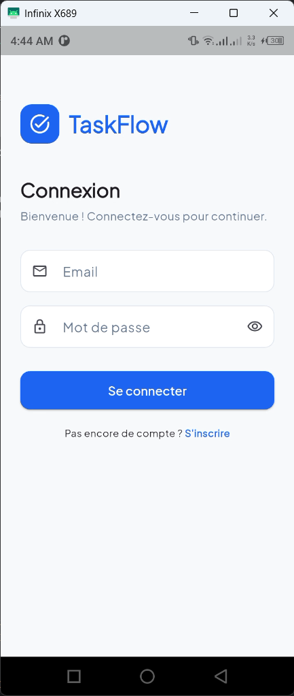
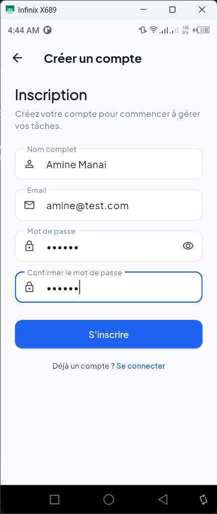
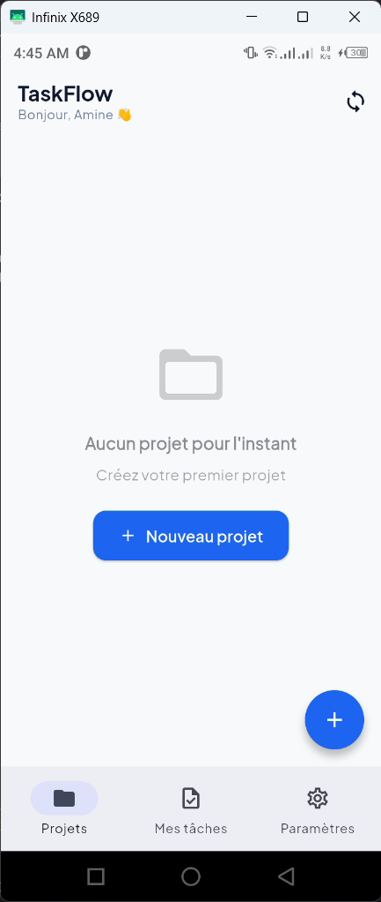
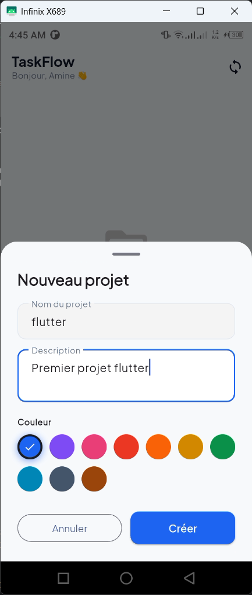
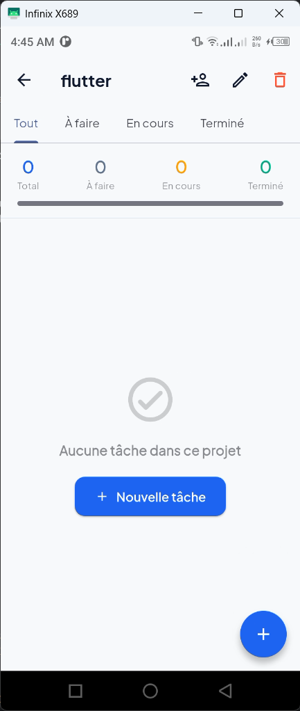
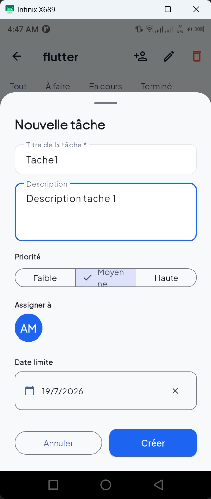
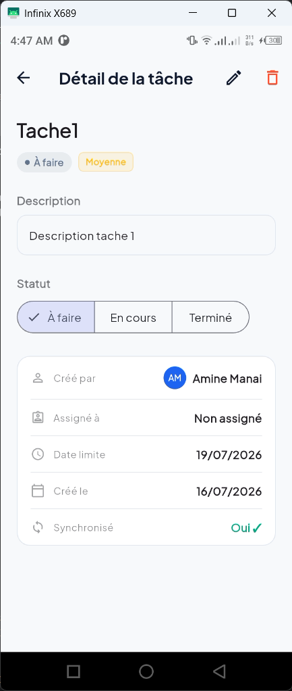
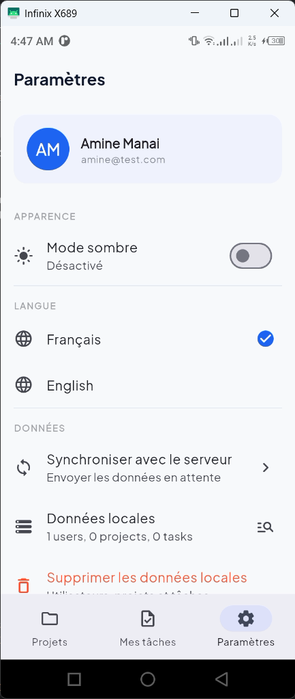
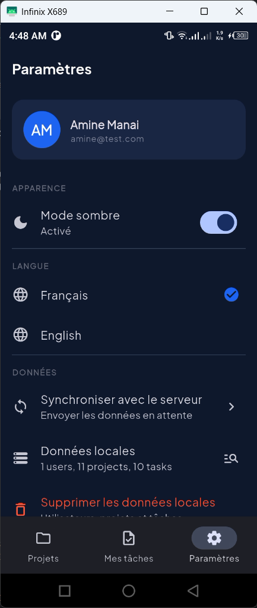

# TaskFlow 📋

Application mobile Flutter de gestion intelligente de tâches individuelles et collaboratives.

## 📱 Fonctionnalités

- **Authentification** – Inscription / Connexion locale (SQLite)
- **Gestion des projets** – Création, modification, suppression avec couleurs personnalisées
- **Gestion des tâches** – CRUD complet avec statut (À faire / En cours / Terminé) et priorité (Faible / Moyenne / Haute)
- **Collaboration** – Assignation de tâches à des utilisateurs
- **Mode hors-ligne** – Données stockées localement (SQLite), synchronisation différée
- **Sync MockAPI** – Synchronisation automatique et manuelle avec l'API REST
- **Notifications locales** – Rappel 1h avant deadline, alerte d'assignation
- **Mode sombre** – Thème clair/sombre persistant
- **Internationalisation** – Français 🇫🇷 et Anglais 🇬🇧

## 🏗️ Architecture

**MVC** (Model – View – Controller)

```
lib/
├── models/          → UserModel, ProjectModel, TaskModel
├── controllers/     → AuthController, ProjectController, TaskController, ThemeController
├── views/           → Screens + Widgets
├── core/
│   ├── database/    → DatabaseHelper (SQLite)
│   ├── network/     → ApiService (MockAPI)
│   ├── theme/       → AppTheme
│   └── utils/       → NotificationService, DateUtils
└── l10n/            → app_fr.arb, app_en.arb
```

## 🛠️ Stack technique

| Élément | Technologie |
|---|---|
| Framework | Flutter 3.x |
| Gestion d'état | **Riverpod** (StateNotifier) |
| Base de données locale | **SQLite** (`sqflite`) |
| Synchronisation API | **MockAPI.io** (REST) |
| Notifications | `flutter_local_notifications` |
| Polices | `google_fonts` (Plus Jakarta Sans) |
| i18n | `flutter_localizations` + ARB |

## 🚀 Installation

### Prérequis
- Flutter SDK ≥ 3.0.0
- Dart SDK ≥ 3.0.0
- Un appareil Android/iOS ou émulateur

### Étapes

```bash
# 1. Cloner le projet
git clone <url-du-projet>
cd taskflow

# 2. Installer les dépendances
flutter pub get

# 3. Générer les fichiers de localisation
flutter gen-l10n

# 4. Lancer l'application
flutter run
```

### Configuration MockAPI

1. Créer un compte sur [mockapi.io](https://mockapi.io)
2. Créer un projet `taskflow`
3. Ajouter 3 ressources :
   - `/users` → id, name, email, avatarUrl
   - `/projects` → id, name, description, color, ownerId, createdAt
   - `/tasks` → id, title, description, status, priority, projectId, creatorId, assigneeId, dueDate, createdAt
4. Copier l'URL de base dans `lib/core/constants/api_constants.dart`

```dart
static const String baseUrl = 'https://VOTRE_ID.mockapi.io/api/v1';
```

## 📸 Captures d'écran

Voici quelques captures d'écran de l'application :

<div align="center">
  <table>
    <tr>
      <td align="center">
        <b>Page de connexion</b><br>
        
      </td>
      <td align="center">
        <b>Page d'inscription</b><br>
        
      </td>
      <td align="center">
        <b>Accueil</b><br>
        
      </td>
      <td align="center">
        <b>Ajouter un projet</b><br>
        
      </td>
      <td align="center">
        <b>Détails d'un projet</b><br>
        
      </td>
    </tr>
    <tr>
      <td align="center">
        <b>Ajouter une tâche</b><br>
        
      </td>
      <td align="center">
        <b>Détails d'une tâche</b><br>
        
      </td>
      <td align="center">
        <b>Paramètres</b><br>
        
      </td>
      <td align="center">
        <b>Mode sombre</b><br>
        
      </td>
      <td></td>
    </tr>
  </table>
</div>


## 👤 Auteur

Projet développé par **Mohamed Amine MANAI**
